# controle de Robô por MQTT
 Projeto de controle de robô por MQTT, com robô real implementado com uma Robocore Vespa e versão de simulação no CoppeliaSim.
## Arquitetura


## Detalhes de implementação
Por enquanto estou usando o broker hiveMW cloud, versão gratuita. O acesso dele é por TLS, logo é necessário colocar o endereço fornecido, port 8883, cadastrar um usuário e senha para acessar.

No código python, precisa carregar o paho.mqtt e o ssl, já que o acesso a este broker é apenas criptografado.

```python
import ssl
import paho.mqtt.client as mqtt
MQTT_BROKER = 'aeb92820898a46f9ac54b16138b489ec.s1.eu.hivemq.cloud' # Precisa mudar para o seu broker
MQTT_PORT = 8883 # Port para conexão TLS
USERNAME = "usuario"  # Substitua pelo usuário que você criar no hiveMQ
PASSWORD = "********"  # Substitua pela senha que você criou. No mínimo 8, com ao menos 1 maiúscula, 1 minúscula e um número.
```
Com isto, para conectar, tem que fazer:
```python
# Criar cliente MQTT
client = mqtt.Client()
client.username_pw_set(USERNAME, PASSWORD) # definir o usuário e senha
client.tls_set(cert_reqs=ssl.CERT_NONE)  # Indicar que usa TLS
client.connect(MQTT_BROKER, MQTT_PORT, 60) # Conectar ao broker
```
Uma vez conectado, tem que informar ao broker os tópicos que vai assinar (subscribe) e definir o que fazer quando chegarem as mensagens nestes tópicos. Isto é verdade tanto para o controlador quanto para o proxy.
```python
# Função para rodar assim que conectar
def on_connect(client, userdata, flags, rc):
    print(f"Conectado com código de resultado {rc}")
    # Subscrever em tópicos após conexão
    client.subscribe(TOPIC_ROBOT_STATUS)
client.on_connect = on_connect

# Função para processar mensagens recebidas
def on_message(client, userdata, msg):
    print(f"Mensagem recebida no tópico {msg.topic}: {msg.payload.decode()}")
client.on_message = on_message
```
## Rodando o exemplo em simulação.
1. Colocar o broker rodando.

    No caso do hiveMQ, ele já está rodando direto.
2. Abrir o coppelia e o scene correto.
    
    No nosso exemplo, o *simpleRobotRemoteControl.ttt*, que tem os dois joints que são buscados no proxy.

    Não precisa simular, pois o proxy vai iniciar e parar a simulação.
3. Iniciar o proxy
```cmd
python .\coppeliasim-mqtt-proxy.py
```
    Idealmente aguardar o proxy se comunicar com o broker.
4. Iniciar o controle
    
    Em outra janela:
```cmd
python .\mqtt-robot-controller.py
```
